# StockPilot System Architecture

## Table of Contents

- [High-Level Architecture](#high-level-architecture)
- [Frontend Architecture](#frontend-architecture)
- [Backend Architecture](#backend-architecture)
- [Data Flow](#data-flow)
- [Database Design](#database-design)
- [Authentication Flow](#authentication-flow)
- [WebSocket Architecture](#websocket-architecture)
- [Multi-Tenancy](#multi-tenancy)
- [Security Architecture](#security-architecture)

---

## High-Level Architecture

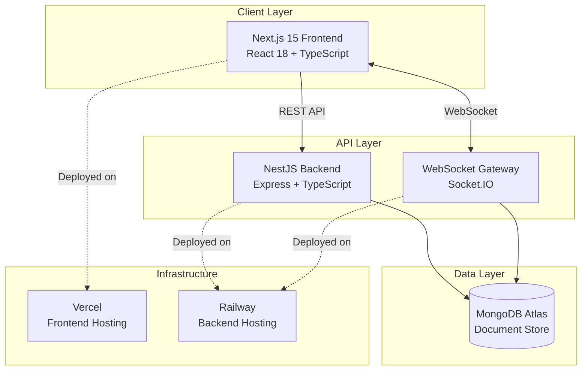

---

## Frontend Architecture

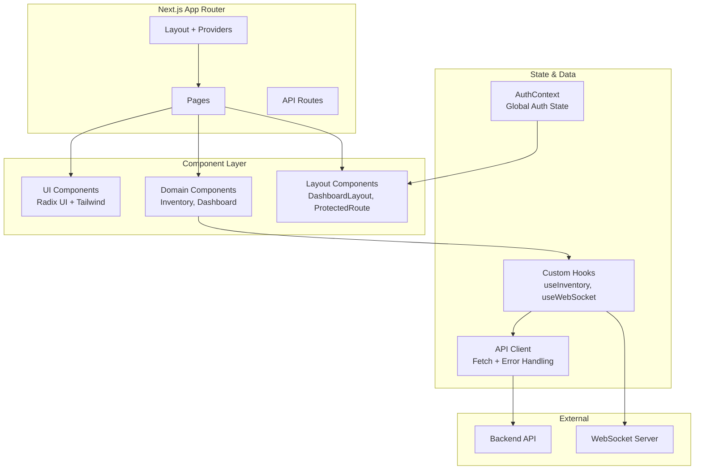

### Frontend Directory Structure

```
src/
├── app/                    # Next.js App Router (pages)
│   ├── page.tsx           # Dashboard (main inventory view)
│   ├── layout.tsx         # Root layout with AuthProvider
│   ├── login/             # Authentication pages
│   ├── register/
│   ├── admin/users/       # Admin panel
│   ├── reports/           # Analytics & reports
│   └── settings/          # User settings
├── components/
│   ├── ui/                # 40+ Radix UI primitives
│   └── inventory/         # Domain-specific components
├── contexts/
│   └── auth-context.tsx   # JWT auth state management
├── hooks/                 # Custom React hooks
│   ├── use-websocket.ts   # Real-time updates
│   ├── use-inventory.ts   # Inventory CRUD
│   └── use-dashboard.ts   # Dashboard data
└── lib/                   # Utilities
    ├── api-client.ts      # HTTP client with auth
    ├── config.ts          # Environment configuration
    └── socket.ts          # WebSocket connection
```

### Key Frontend Patterns

- **Server Components**: Used for layout and static content
- **Client Components**: Used for interactive features (forms, real-time data)
- **Protected Routes**: `ProtectedRoute` component wraps authenticated pages
- **Error Boundaries**: Graceful error handling at page level
- **Optimistic Updates**: UI updates before server confirmation
- **Real-time Sync**: WebSocket-driven state updates

---

## Backend Architecture

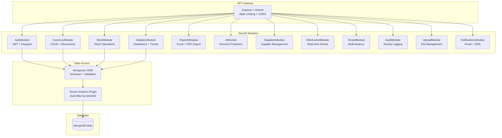

### Backend Module Responsibilities

| Module | Responsibility |
|--------|---------------|
| **AuthModule** | User registration, login, JWT tokens, RBAC |
| **InventoryModule** | Item CRUD, stock movements, forecasting |
| **StockModule** | Stock add/remove/adjust operations |
| **AnalyticsModule** | Dashboard KPIs, trends, alerts |
| **ReportsModule** | Report generation, Excel/PDF export |
| **AIModule** | Demand prediction, optimization |
| **SuppliersModule** | Supplier CRUD, search, filtering |
| **WebSocketModule** | Real-time events broadcasting |
| **TenantModule** | Multi-tenant management |
| **AuditModule** | Activity logging, audit trail |
| **UploadModule** | Image upload and management |
| **NotificationsModule** | Email/SMS notifications |

---

## Data Flow

### Request Lifecycle

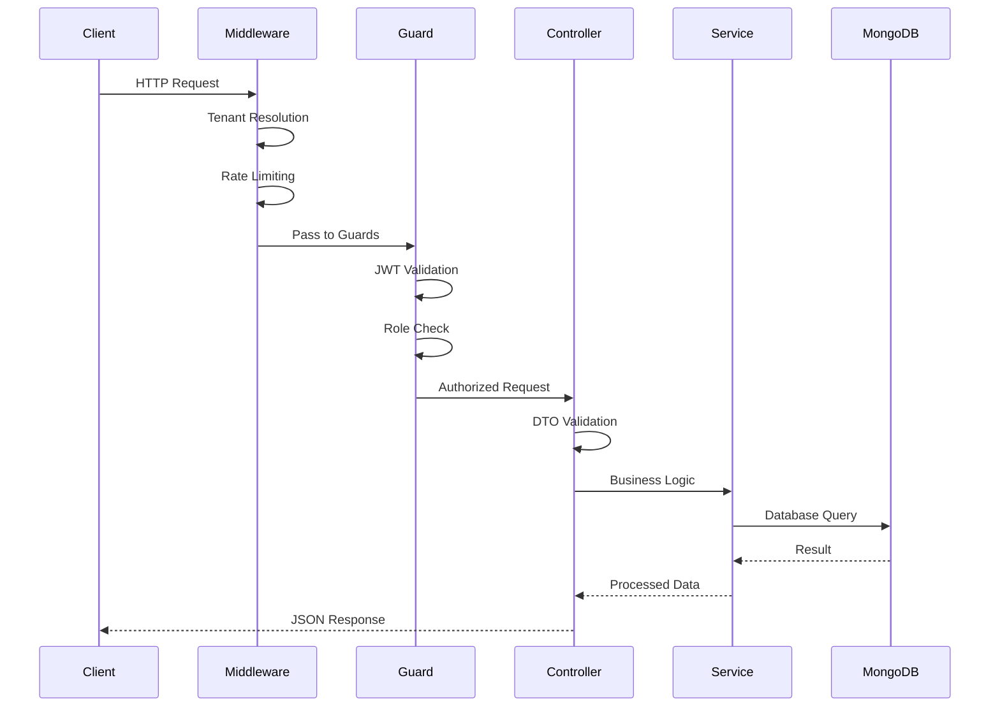

### Real-time Update Flow

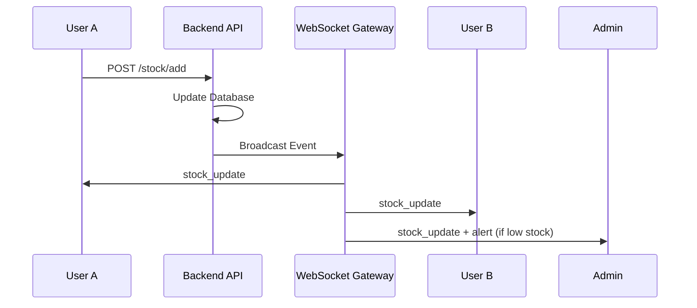

---

## Database Design

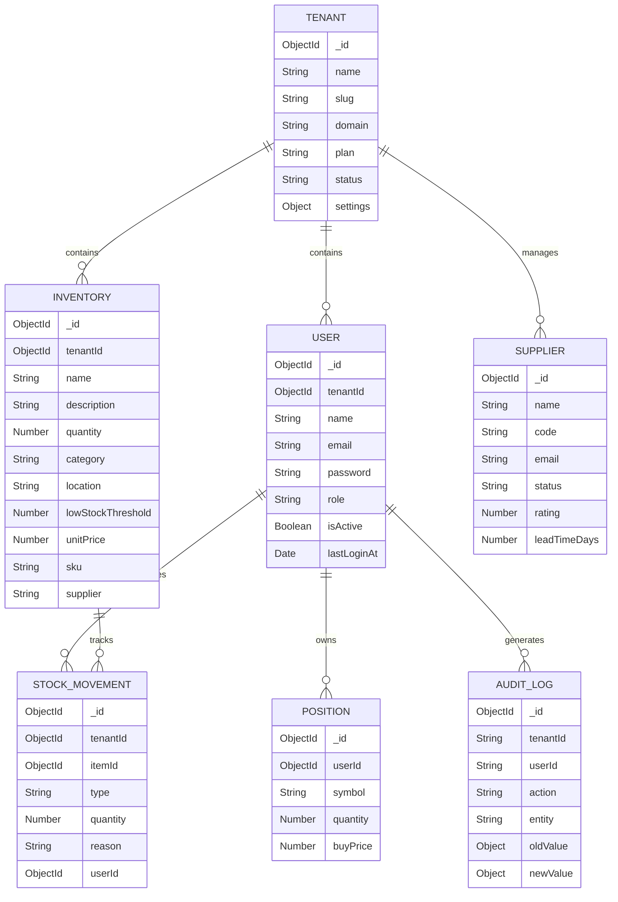

---

## Authentication Flow

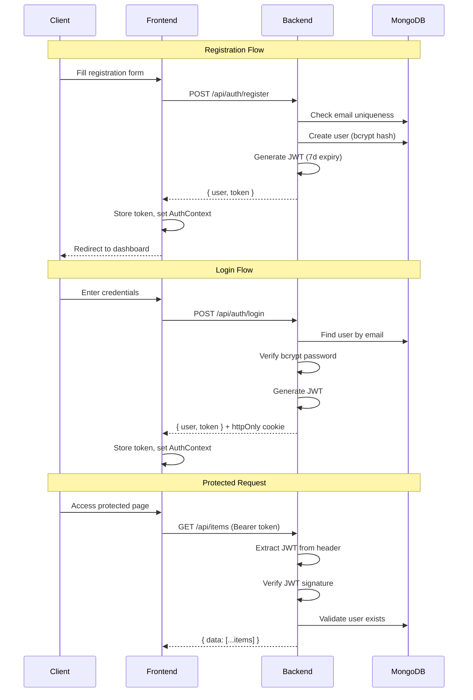

### Role-Based Access Control

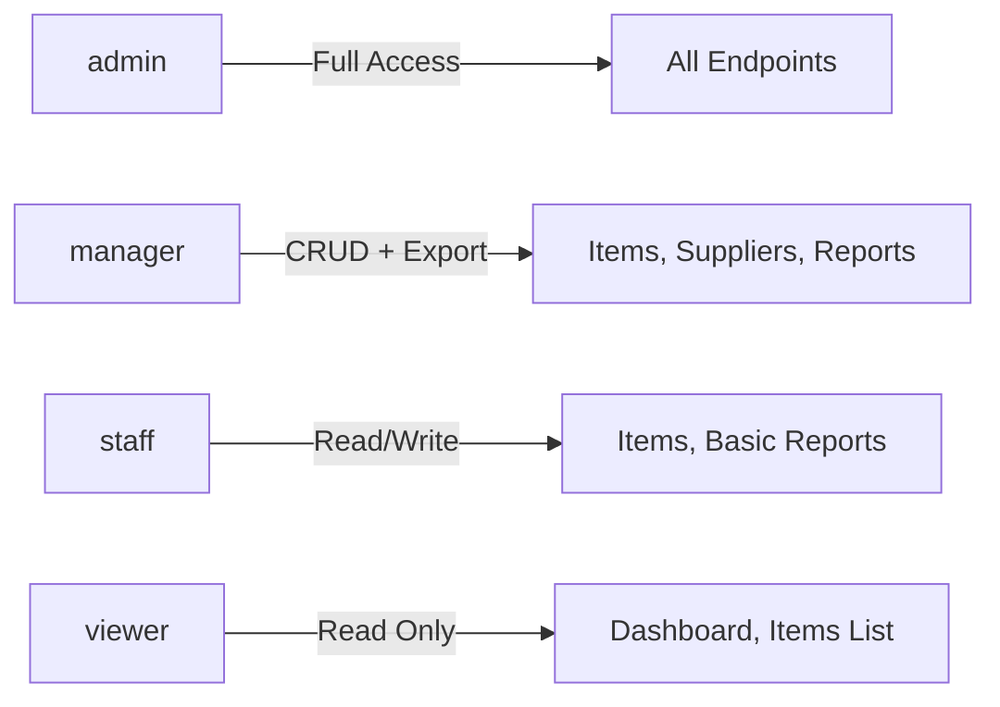

---

## WebSocket Architecture

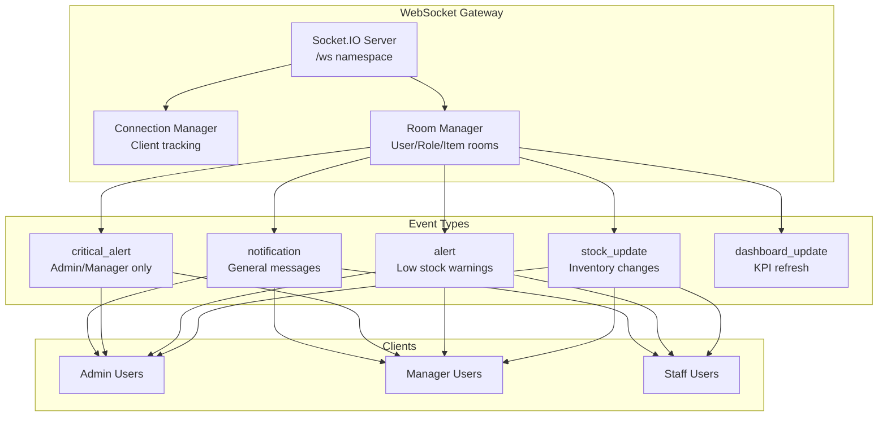

### Connection Lifecycle

1. Client connects to `wss://backend/ws`
2. Client emits `authenticate` with `{ userId, role }`
3. Server joins client to role-based rooms
4. Client subscribes to specific items via `subscribe_item`
5. Server broadcasts events to appropriate rooms
6. Auto-reconnect on disconnect (5 attempts, exponential backoff)

---

## Multi-Tenancy

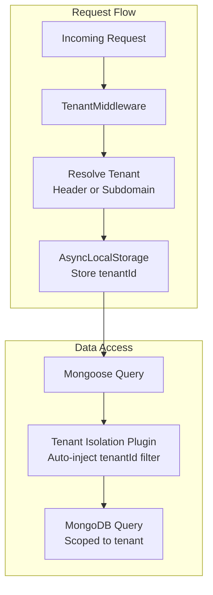

### Tenant Resolution Order

1. `X-Tenant-Id` header (API clients)
2. Subdomain extraction (web clients)
3. Default tenant fallback

---

## Security Architecture

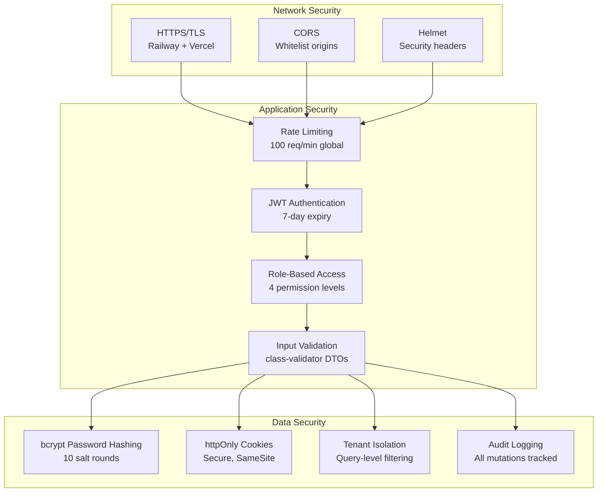

### Security Measures

| Layer | Measure | Implementation |
|-------|---------|----------------|
| Transport | TLS 1.3 | Railway + Vercel (automatic) |
| Network | CORS | Whitelist production + localhost |
| Network | Rate Limiting | NestJS Throttler (100/min, 10/min auth) |
| Headers | Security Headers | Helmet middleware |
| Auth | JWT Tokens | 7-day expiry, httpOnly cookies |
| Auth | Password Hashing | bcrypt, 10 rounds |
| Access | RBAC | 4 roles with granular permissions |
| Data | Input Validation | class-validator on all DTOs |
| Data | Tenant Isolation | Mongoose plugin auto-filters |
| Audit | Activity Logging | All CRUD operations logged |

---

## Technology Stack

| Layer | Technology | Purpose |
|-------|-----------|---------|
| Frontend | Next.js 15 | React framework with App Router |
| UI | Radix UI + Tailwind CSS | Accessible component library |
| Charts | Recharts | Data visualization |
| State | React Context + Hooks | Client-side state management |
| Backend | NestJS 10 | Enterprise Node.js framework |
| Runtime | Express.js | HTTP server |
| Database | MongoDB + Mongoose | Document database + ODM |
| Auth | Passport + JWT | Authentication strategy |
| Real-time | Socket.IO | WebSocket communication |
| Exports | ExcelJS + PDFKit | Report generation |
| Email | Resend | Transactional emails |
| Frontend Host | Vercel | Edge deployment |
| Backend Host | Railway | Container hosting |
| Database Host | MongoDB Atlas | Managed database |
